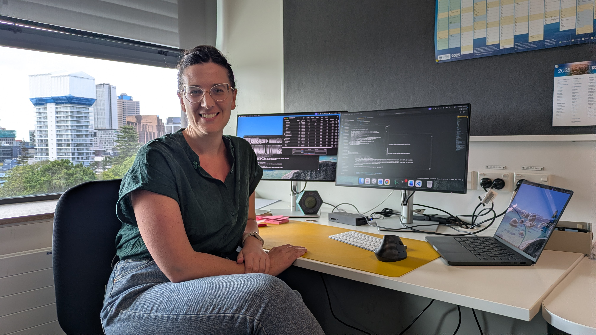

## [home](https://emily-gordy.github.io/) | [research](https://emily-gordy.github.io/research/) | [media](https://emily-gordy.github.io/media/) | [publications](https://emily-gordy.github.io/publications/)

## Take Ten With Emily Gordon

[#### Interview with University of Auckland Take Ten with Series:](https://www.auckland.ac.nz/en/science/our-research/take-10-with/take-10-with-physics/take-10-with-emily-gordon.html)

## Toward a Deeper Understanding of Our Climate System Through Data Science

#### Presentation at Women In Data Science (WiDS) 2024

<iframe width="560" height="315" src="https://www.youtube.com/embed/mSmcLoShzxg" frameborder="0" allow="accelerometer; autoplay; clipboard-write; encrypted-media; gyroscope; picture-in-picture" allowfullscreen></iframe>

* * * 

## Profile By Stanford Data Science

[The Joyous Side of Data Science, Perseverance, and Long-Distance Running](https://datascience.stanford.edu/news/joyous-side-data-science-perseverance-and-long-distance-running)

